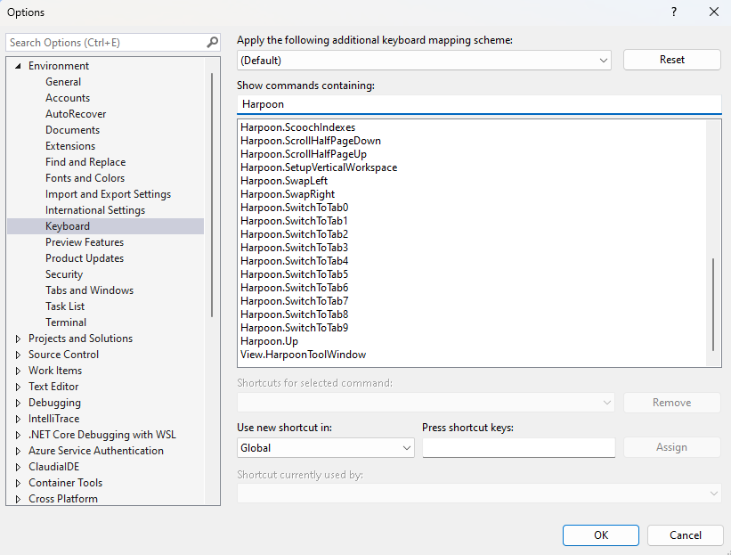

Lets you switch between tabs quickly

This extension provides below commands : 

**Harpoon.AppendTab**  : start tracking tab by appending tab to the first available block/index (0  through  9)

**Harpoon.DeleteTab**  : untrack current tab

**Harpoon.OverwriteTab0**  : overwrites index/block 0 with current tab

**Harpoon.OverwriteTab1**  : overwrites index/block 1 with current tab

**Harpoon.OverwriteTab2**  : overwrites index/block 2 with current tab

**Harpoon.OverwriteTab3**  : overwrites index/block 3 with current tab

**Harpoon.OverwriteTab4**  : overwrites index/block 4 with current tab

**Harpoon.OverwriteTab5**  : overwrites index/block 5 with current tab

**Harpoon.OverwriteTab6**  : overwrites index/block 6 with current tab

**Harpoon.OverwriteTab7**  : overwrites index/block 7 with current tab

**Harpoon.OverwriteTab8**  : overwrites index/block 8 with current tab

**Harpoon.OverwriteTab9**  : overwrites index/block 9 with current tab

**Harpoon.NextTab**  : switches to the next available block/index

**Harpoon.PrevTab**  : switches to the previous available block/index

**Harpoon.SwitchToTab0**  : switces tab to index/block 0

**Harpoon.SwitchToTab1**  : switces tab to index/block 1

**Harpoon.SwitchToTab2**  : switces tab to index/block 2

**Harpoon.SwitchToTab3**  : switces tab to index/block 3

**Harpoon.SwitchToTab4**  : switces tab to index/block 4

**Harpoon.SwitchToTab5**  : switces tab to index/block 5

**Harpoon.SwitchToTab6**  : switces tab to index/block 6

**Harpoon.SwitchToTab7**  : switces tab to index/block 7

**Harpoon.SwitchToTab8**  : switces tab to index/block 8

**Harpoon.SwitchToTab9**  : switces tab to index/block 9

**Harpoon.SwapLeft**  : swaps current tab with tab on left

**Harpoon.SwapRight**  : swaps current tab with tab on right

**Harpoon.ClearAll**  : clears all tracked items

**Harpoon.GotoFirst**  : Jumps to first tracked index

**Harpoon.GotoLast**  : Jumps to last tracked index

**Harpoon.SaveSession**  : saves tracked items in a new file called .harpoon_sessions at the level of solution file. 

**Harpoon.ScoochIndexes**  : Recovers empty indexes

**View.HarpoonToolWindow** : window showing index to tab assignment

See the full list of Command Ids by going to `Tools > Options > Environment > Keyboard > Search for 'Harpoon'`:

You can customize your own shortcuts there.